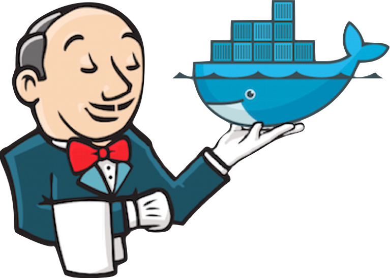

# Continuous Integration on a Whale

[logo]: docs/docker-jenkins.png



# Goals
The goals of this project are as follows:

Provide a basic set of continuous integration pipeline tools that:
* is easy to start with
* easy to keep up-to-date
* configurable for specific environment needs
* is capable out-of-the-box to build and store docker images

# Assumptions
This project, how ever well setup it might be, does make some assumptions:
* environment that can run bash shell scripts
* has native docker support
* runs [docker-dns](https://hub.docker.com/r/phensley/docker-dns/) with domain "docker"
* you are familiar with [docker basics](https://docs.docker.com/linux/)
* you are familiar with [docker terminology](https://docs.docker.com/engine/reference/glossary/)
* you are familiar with [docker networking](https://docs.docker.com/engine/userguide/networking/dockernetworks/)
* Docker 1.10.0+
* WGET is available on command line

# Run the script
Main entry is cli.sh, which supports several actions and several services.
```bash
cli.sh $configFile $action [$service]
```

While there is a log in the console, there's also a more verbose loggin in *cow.log*.
This file also contains all the docker outpus.

## Parameters
* configFile: should be a filename of a file that exists in the config folder, excluding the extension
  * example: "wanju" will load config/wanju.conf
* action: the action the script has to perform
  * init: will initialize the folders and sonarqube plugins
  * build: will build all the docker images
  * run: will run all the docker container instances
  * start: will start all the docker container instances
  * stop: will stop all the docker container instances
* Service: optional parameter that will limit the action to a service
  * jenkins: will perform the action for the docker images/containers related to Jenkins 2
  * nexus: will perform the action for the docker images/containers related to Nexus 3
  * sonar: will perform the action for the docker images/containers related to SonarQube 5


# Standards

## Naming standards
* docker image: <name-of-main-service>-image
* docker container: <name-of-main-service>-instance
* docker container proxy: <name-of-main-service>
* script logging: [CoW][<service>][<action>][<log level>]  <text>
  * example: [CoW][sonarqube5][init][ERROR] No $CONFIG found, exiting ...

Examples:
Docker container for Jenkins:
* image -> jenkins-image
* container -> jenkins-instance
* proxy -> jenkins


## Service setup standard
* hierarchical folder structure
* subfolder in root <name-of-main-service>
* run.sh to run the container
* start.sh to start the container
* build.sh to build the image
* any additional containers that are part of this service, will follow the same structure but one level deeper
* if any additional containers are required, they must be linked in the appropriate script
  * for example: sonarqube requires its own db, sonarqube's run.sh should call the db's run.sh
